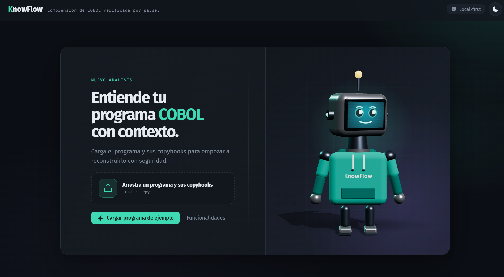

<div align="center">

# KnowFlow

**Entiende un programa COBOL sin leer el código.**

Le das un `.cbl` y sus copybooks `.cpy`, y KnowFlow te devuelve el flujo de ejecución, el
esquema de datos byte a byte, qué toca (ficheros, DB2, CICS), dónde se usa cada campo y una
explicación en lenguaje llano — todo anclado a la línea del fuente que lo demuestra.

Pensado para el desarrollador **junior que hereda** un programa de mainframe cuando el veterano
que lo escribió ya no está.

`local-first` · `BYOK` · `Apache-2.0` · `sin backend`

[](https://github.com/miguelduran14/KnowFlow/actions/workflows/ci.yml)
[](LICENSE)


<br>



</div>

---

## Por qué existe

Las herramientas de análisis COBOL existentes están pensadas para *proyectos de migración*
(IBM watsonx, AWS Transform, consultoras): pesadas, caras, y no resuelven el problema real del
día a día — entender un programa concreto para mantenerlo. La alternativa real de un junior hoy
es pegar el código en un chat genérico, que **alucina** en dialecto mainframe (confunde
`SYSCAT.COLUMNS` con `SYSIBM.SYSCOLUMNS` en DB2 z/OS, por ejemplo) y no verifica nada de lo que
dice.

KnowFlow separa las dos cosas:

- Un **parser determinista** extrae los hechos estructurales exactos: divisiones, párrafos,
  grafo `PERFORM`/`CALL`/`GO TO`, resolución de `COPY`, niveles/`PIC`/`OCCURS`/`REDEFINES`/`COMP`,
  bloques `EXEC SQL`/`EXEC CICS`, y de dónde viene y a dónde va cada dato.
- La **IA solo narra** esos hechos ya verificados, en lenguaje llano — nunca ve el código fuente
  crudo, así que no puede inventar estructura que no esté verificada.

Todo resultado lleva su **nivel de fidelidad**: lo que el parser verificó, y lo que queda marcado
como hueco (copybook ausente, `CALL` dinámica, destino no encontrado) en vez de rellenarse con una
suposición. Es el principio de no-invención del proyecto ([ADR-0003](docs/adr/0003-niveles-de-fidelidad-y-no-invencion.md)).

## Empezar en 30 segundos

```bash
git clone https://github.com/miguelduran14/KnowFlow.git
cd KnowFlow
npm install
npm run build
npm start
```

Abre `http://localhost:4173` en tu navegador. Pulsa **«Cargar ejemplo»** para ver la herramienta
en marcha con una cadena de programas de banca sintéticos (`examples/`) — sin subir nada tuyo — o
arrastra tu propio `.cbl` y sus `.cpy`.

> **Local-first / BYOK.** Tu código nunca sale de tu máquina salvo la llamada al proveedor de IA
> que tú mismo configures (Claude, o un endpoint corporativo compatible con OpenAI) para la capa de
> explicación. Esa clave se guarda solo en tu navegador. Todo lo demás —flujo, datos, inventario,
> usos, trazabilidad, avisos— corre siempre local y no necesita ninguna clave. No hay backend
> propio ([ADR-0002](docs/adr/0002-gui-web-local-motor-como-libreria.md)).

## Qué ves

| Vista | Qué responde |
|---|---|
| **Explicación** | Resumen y recorrido en lenguaje llano, generado por IA sobre los hechos del parser — cada etapa enlaza al párrafo real que la demuestra. |
| **Flujo** | Cómo se recorre el programa: párrafos y secciones, `PERFORM`/`CALL`/`GO TO`, la condición bajo la que ocurre cada arista, caídas naturales. Lienzo interactivo: clic en un nodo abre su ficha (a qué llama, quién lo llama, qué EXEC/E-S contiene), busca párrafos, pliega secciones y **exporta a Mermaid, SVG o PNG**. |
| **Datos** | El esquema como memoria: un mapa de bytes proporcional (cada campo ocupa el ancho de sus bytes reales) con `PIC`, `OCCURS`, `REDEFINES`, `COMP-3`, niveles 88/66 y offsets. Fija un campo (clic) para ver, en la misma ficha, **dónde se usa** y su **trazabilidad**. Tabla clásica siempre disponible como alternativa. |
| **Qué toca** | Ficheros con su E/S, tablas DB2, cursores y su ciclo `DECLARE`/`OPEN`/`FETCH`/`CLOSE`, comandos CICS — extracción literal, sin interpretar qué hace una consulta. |
| **Avisos** | Trampas de mantenimiento verificadas contra el fuente: `STOP RUN` en un subprograma, `UPDATE`/`DELETE` sin `WHERE`, `GO TO` que cruza de sección, fichero o cursor sin cerrar, párrafo inalcanzable, `ALTER`… No son huecos de fidelidad: son cosas que *sí* están, pero muerden. |
| **Cadena** | Qué `CALL` cruza a qué programa, cuando aportas varios fuentes a la vez. |

### Dónde se usa cada campo (where-used)

Fija un campo en el mapa de bytes y KnowFlow lista cada punto de la `PROCEDURE DIVISION` donde se
**lee** o se **escribe**, con verbo, párrafo y línea, incluyendo las host variables de `EXEC SQL`.
Cada uso salta al diagrama de Flujo o al código. Lo que el reparto de roles no puede afirmar con
certeza (`CALL … USING` por referencia, `MOVE CORRESPONDING`, un homónimo) va **marcado**, no
adivinado.

### Trazabilidad de datos

Desde ese mismo campo, sigue **de dónde viene** su valor y **a dónde va**, encadenando
`MOVE`/`COMPUTE`/aritmética/`STRING` y los solapes `REDEFINES`:

```
MOV-IMPORTE → WS-BRUTO → WS-INTERES → WS-TOTAL → WS-TOTAL-ED → RPT-REGISTRO
```

Es insensible al orden de ejecución (cada tramo es un flujo *posible*, no el que gana al final):
una respuesta honesta y acotada a «¿de dónde sale este importe del informe?».

### Dossier de onboarding

Un botón exporta todo el análisis a un `.md` autocontenido —prosa de IA (si la hay) + diagrama
Mermaid + esquema + usos + trazabilidad + inventario + avisos + límites de lo verificado— listo
para pegar en una wiki o un PR. Se arma en el navegador; nada sale de tu máquina.

### Modo aprendiz

Resalta los términos COBOL (`COMP-3`, `REDEFINES`, `EVALUATE`…) con una ficha explicativa al pasar
el ratón — no la genera un modelo, es un glosario propio.

## Qué NO es

- No es un traductor/migrador COBOL→Java.
- No es una plataforma de análisis de *estate* completo.
- No genera código ni tipos a partir de copybooks.

Cuanto más estrecho el propósito —entender UN programa para mantenerlo— mejor. El contexto
completo del producto, la arquitectura y las decisiones están en [`CONTEXT.md`](CONTEXT.md) y en
[`docs/adr/`](docs/adr/).

## El ejemplo

`examples/` contiene una cadena de banca **sintética** (`ctamov01` → `valida01` / `fecha01` +
copybooks) escrita desde patrones típicos, no copiada de nadie. Ejercita todas las vistas y lleva
dos avisos plantados a propósito. Ver [`examples/README.md`](examples/README.md).

## Restricción importante

**Nunca** proceses COBOL de clientes/empleador con esta herramienta ni con ningún agente de IA
sobre este repo. La herramienta y cualquier agente envían lo que leen a un proveedor de IA: la
violación ocurre en el primer *read*, no en el *push*. Usa solo COBOL sintético o público
(GnuCOBOL, suite NIST, repos abiertos). Es una cuestión de propiedad intelectual, no negociable.

## Desarrollo

```bash
npm install
npm run dev --prefix gui   # servidor de desarrollo con recarga en caliente (Vite)
```

```bash
npm test        # suite de tests del motor (parser, flujo, inventario, usos, trazabilidad, cadena)
npm run verify  # typecheck + tests + build completo (motor + GUI) — lo que corre antes de publicar
```

El motor (`src/`) es una librería TypeScript independiente de la GUI (`gui/`) y se puede ejercitar
sin interfaz con el arnés de desarrollo: `npx tsx harness/flow.ts <fichero.cbl>`.

```ts
import { parse, parseFlow, parseInventory, collectReferences, traceField } from 'knowflow'
```

## Licencia

Apache-2.0. Ver [ADR-0004](docs/adr/0004-licencia-apache-2.md) para el porqué (cláusula de
patentes + pasa revisiones legales corporativas; AGPL está prohibido por política en banca).
